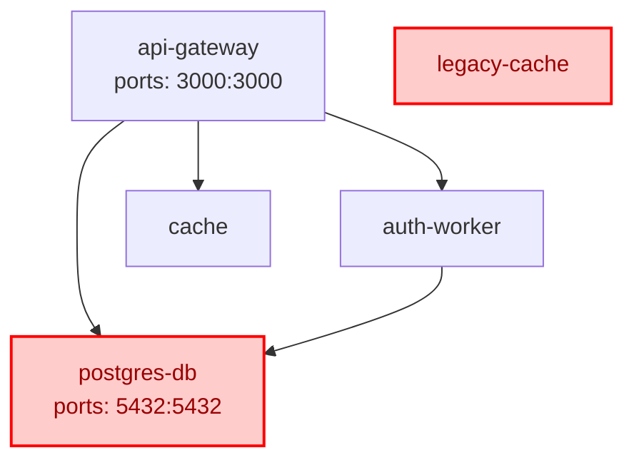

# Architecture Security Map

**Generated:** 5/21/2026, 12:16:18 PM
**Services:** 5
**Risks Found:** 2

## Service Dependency Graph

## Risk Summary

| Service | Severity | Finding |
|---------|----------|---------|
| legacy-cache | LOW | Service "legacy-cache" has no connections to or from any other service. This may indicate dead code or a misconfigured dependency graph. |
| postgres-db | HIGH | Internal database "postgres-db" exposes port(s) [5432:5432] to the host network. This allows direct external access to the data store, bypassing all application-layer security. |
