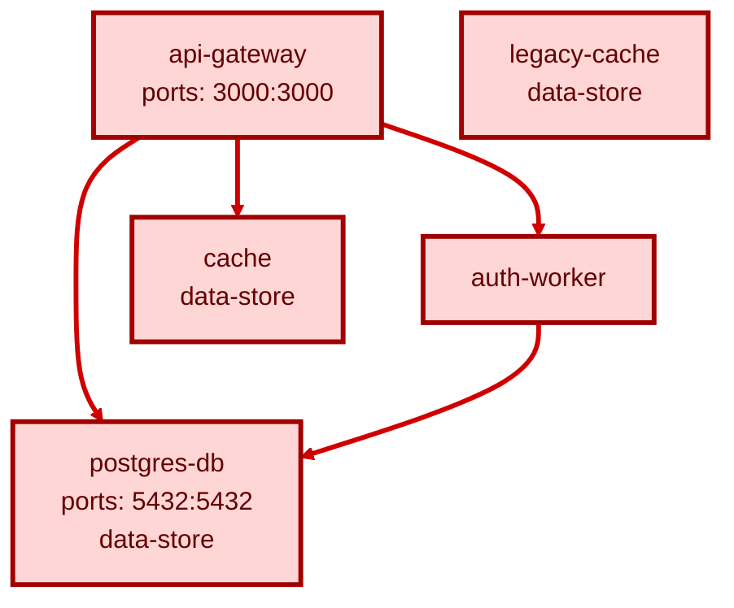

# Microservice Attack Path & Blast Radius Report

**Generated:** 5/21/2026, 12:17:16 PM
**Services:** 5
**Public Entry Points:** 2
**Total Risks:** 11
**High-Risk Paths:** 4

## Service Attack Graph

## Public Entry Points

- **api-gateway:** Exposes host port(s): 3000:3000
- **postgres-db:** Exposes host port(s): 5432:5432

## High-Risk Attack Paths

- **CRITICAL:** api-gateway -> cache - "api-gateway" can reach critical data-store "cache".
- **CRITICAL:** api-gateway -> postgres-db - "api-gateway" can reach critical data-store "postgres-db".
- **CRITICAL:** api-gateway -> auth-worker -> postgres-db - "api-gateway" can reach critical data-store "postgres-db".
- **HIGH:** auth-worker -> postgres-db - "auth-worker" can reach critical data-store "postgres-db".

## Blast Radius

| Service | Severity | Score | Reachable Services | Critical Assets |
|---------|----------|-------|--------------------|-----------------|
| api-gateway | CRITICAL | 32 | auth-worker, cache, postgres-db | cache, postgres-db |
| auth-worker | HIGH | 16 | postgres-db | postgres-db |
| cache | LOW | 4 | - | - |
| legacy-cache | MEDIUM | 9 | - | - |
| postgres-db | HIGH | 23 | - | - |

## Fix Recommendations

- **api-gateway / LOW:** Add a healthcheck that verifies the service is ready before dependent services start.
- **api-gateway / MEDIUM:** Set a least-privilege user in the image or compose service definition.
- **auth-worker / LOW:** Add a healthcheck that verifies the service is ready before dependent services start.
- **auth-worker / MEDIUM:** Set a least-privilege user in the image or compose service definition.
- **cache / MEDIUM:** Set a least-privilege user in the image or compose service definition.
- **legacy-cache / MEDIUM:** Set a least-privilege user in the image or compose service definition.
- **legacy-cache / MEDIUM:** Pin images to immutable version tags or digests for repeatable builds.
- **legacy-cache / LOW:** Remove the service if unused, or define the missing dependency/network relationship.
- **postgres-db / HIGH:** Remove host port mappings from internal stateful services and expose them only on private Docker networks.
- **postgres-db / HIGH:** Move secrets into a secret manager or Docker/Kubernetes secrets and inject them at runtime.
- **postgres-db / MEDIUM:** Set a least-privilege user in the image or compose service definition.
